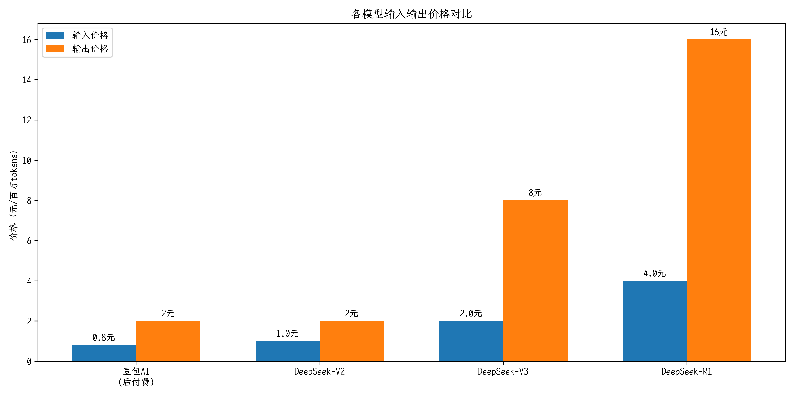
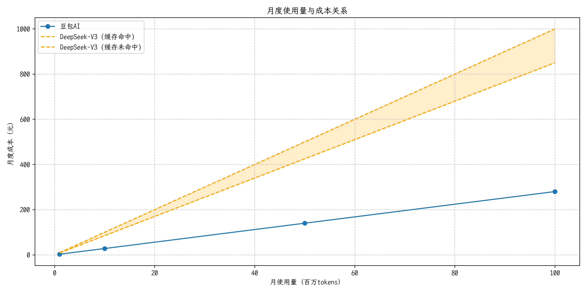
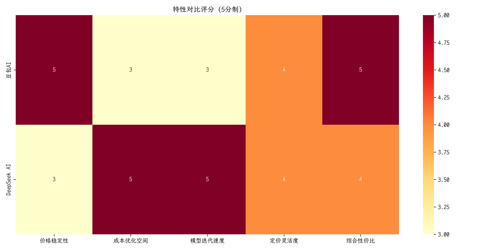

# 豆包 AI vs Deepseek AI 定价对比报告

## 1. 基础定价模型

### 豆包 AI
- **后付费模式**（豆包通用模型 pro-32k）：
  - 推理输入：0.0008元/千Tokens
  - 推理输出：0.002元/千Tokens
  - 综合价格：约0.001元/千Tokens
- **预付费模式**（豆包通用模型 pro-32k）：
  - 10K TPM包月价格：2000元
  - 平均价格：约0.0046元/千Tokens

### Deepseek AI
- **DeepSeek-V2**（2024年5月）：
  - 输入：1元/百万tokens
  - 输出：2元/百万tokens
  - 上下文窗口：32K
- **DeepSeek-V3**（2024年12月）：
  - 输入：0.5元（缓存命中）/2元（缓存未命中）/百万tokens
  - 输出：8元/百万tokens
- **DeepSeek-R1**（2025年1月）：
  - 输入：1元（缓存命中）/4元（缓存未命中）/百万tokens
  - 输出：16元/百万tokens

## 2. 计费特点对比

| 特性 | 豆包 AI | Deepseek AI |
|------|---------|-------------|
| 计费单位 | 千Tokens | 百万Tokens |
| 计费模式 | 后付费/预付费 | 后付费 |
| 区分输入输出 | 是 | 是 |
| 缓存优化 | 否 | 是（V3/R1） |
| 企业版定制 | 支持 | 支持 |

## 3. 功能特性对比

### 豆包 AI 优势
1. 价格稳定，长期维持较低水平
2. 计费模式灵活（支持后付费和预付费）
3. 综合成本较低
4. 支持多种支付方式（支持人民币结算）

### Deepseek AI 优势
1. 持续迭代升级模型
2. 支持缓存优化降低成本
3. 多代模型可选
4. 性能持续提升

## 4. 成本估算示例

### 小型企业场景（每月100万tokens用量）
- 豆包 AI（后付费）：
  - 输入成本：约0.8元
  - 输出成本：约2元
  - 总成本：约2.8元
- Deepseek AI（以V3为例）：
  - 输入成本：0.5-2元
  - 输出成本：8元
  - 总成本：8.5-10元

### 中型企业场景（每月1亿tokens用量）
- 豆包 AI（预付费）：
  - 固定成本：2000元/月（10K TPM）
  - 平均成本：约460元
- Deepseek AI（以V3为例）：
  - 输入成本：50-200元
  - 输出成本：800元
  - 总成本：850-1000元

## 5. 选择建议

1. **适合使用豆包 AI 的场景**：
   - 对成本控制要求严格的企业
   - 需要稳定定价的长期项目
   - 倾向于固定成本的预算模式
   - 主要面向国内市场的应用

2. **适合使用 Deepseek AI 的场景**：
   - 需要最新模型能力的项目
   - 有能力优化token使用的团队
   - 重视性能提升的场景
   - 愿意为更好性能支付溢价的企业

## 6. 注意事项

1. Deepseek的价格策略显示出明显的迭代升级趋势，新模型定价较高
2. 豆包AI的预付费模式适合用量稳定的场景
3. 实际成本还需考虑缓存优化和token使用效率
4. 建议结合实际使用场景和预算进行选择

## 7. 总结

从价格策略来看：

1. **豆包 AI** 采取稳定低价策略：
   - 价格长期稳定在较低水平
   - 提供灵活的付费方式
   - 适合成本敏感型用户
   - 总体使用成本较低

2. **Deepseek AI** 采取迭代升级策略：
   - 不同代际模型差异定价
   - 新模型定价较高
   - 通过缓存机制优化成本
   - 注重性能提升

建议用户根据自身需求特点选择：
- 如果预算有限，建议选择豆包AI
- 如果追求性能，可以考虑Deepseek的新模型
- 可以先使用较早代际的模型进行测试
- 评估实际token用量后再做决策 