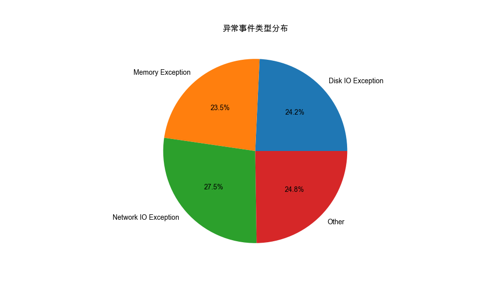
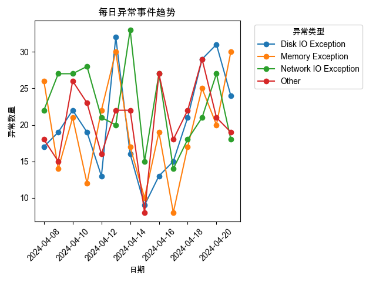

# 系统异常事件分析报告

## 数据概览
数据库记录了2024年4月的系统异常事件，包含以下四种类型的异常：
1. 网络IO异常 (Network IO Exception): 318次
2. 其他异常 (Other): 286次
3. 磁盘IO异常 (Disk IO Exception): 280次
4. 内存异常 (Memory Exception): 271次

## 数据可视化分析

### 1. 异常事件类型分布

从饼图可以看出：
- 网络IO异常占比最高，约27.5%
- 其他三种类型的异常分布相对均匀，各占约23-25%
- 系统IO相关的异常（网络IO + 磁盘IO）共占总异常的52%左右

### 2. 异常事件时间趋势

从趋势图可以观察到：
- 每种类型的异常每天都有发生
- 异常数量在不同日期之间有波动，但总体保持在一定范围内
- 平均每天发生约80次异常事件

## 主要发现
1. **IO异常频发**：系统IO（网络和磁盘）相关的异常占比超过50%，这可能表明系统的IO性能需要优化。

2. **异常分布均衡**：除了网络IO异常略高外，其他类型的异常分布相对均匀，这可能表明系统面临多方面的稳定性挑战。

3. **持续性问题**：异常事件持续发生，且数量较大，平均每天约80次异常，这表明系统存在需要解决的稳定性问题。

## 建议
1. **优化网络性能**：
   - 检查网络配置和连接稳定性
   - 考虑增加网络带宽或优化网络架构
   - 实施网络监控和预警机制

2. **IO性能优化**：
   - 评估当前磁盘IO性能
   - 考虑使用缓存机制减少IO操作
   - 优化数据存储和访问模式

3. **内存管理**：
   - 检查内存使用情况和泄漏问题
   - 优化内存分配和回收机制
   - 考虑增加系统内存容量

4. **监控告警**：
   - 建立实时监控系统
   - 设置合理的告警阈值
   - 实施自动化响应机制

## 后续行动
建议进行以下深入分析：
1. 分析异常发生的具体时间模式（是否存在特定时段异常较多的情况）
2. 研究不同类型异常之间的相关性
3. 建立预测模型，提前预警可能的系统问题 